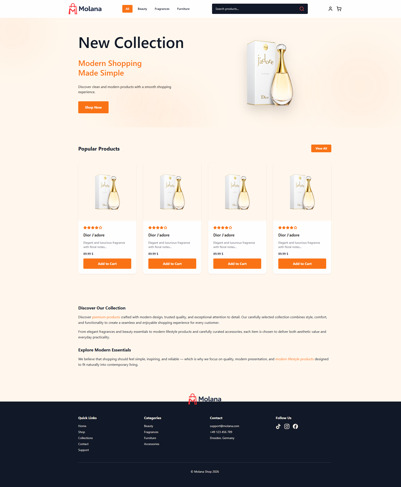

# Mini Commerce (Nuxt) — Molana Shop

A **portfolio-grade e-commerce frontend** built with **Nuxt 4**, **Vue 3 (Composition API)**, **TypeScript**, and **Tailwind CSS**, backed by **Directus** as a headless CMS. The focus is on scalable structure, reusable UI, and real-world patterns (API layer, Pinia, auth, routing).

---

## Design

### Figma

Homepage UI/UX (responsive layout, product cards, header & footer):

[View Figma Design](https://www.figma.com/make/FSqLxFaAz6o3P7bNT8TQKl/Enhance-spacing-and-mobile-design?code-node-id=0-9&p=f&t=CDQxG8RMp7zO2eu6-0&fullscreen=1)

### Homepage preview



---

## Tech stack

| Layer | Technology |
|--------|------------|
| Framework | **Nuxt 4** |
| UI | **Vue 3** (Composition API, `<script setup>`) |
| Language | **TypeScript** |
| Styling | **Tailwind CSS** |
| Icons | **@nuxt/icon** |
| State | **Pinia** (cart) |
| Backend | **Directus** (REST via Nitro server routes + dev proxy) |

---

## Features

### Homepage

- **Hero** (`HomeHero`) — CTA to shop, brand imagery
- **Popular products** (`HomePopularProducts`) — up to 4 items from `/api/products/featured` (`featured` field in Directus)
- **Brand story** (`HomeBrandStory`)

### Catalog & search

- **All products** — `/products` (`products/index.vue`)
- **Search** — query `?q=` on `/products` (submit from header; debounce not used)
- **Category pages** — `/category/[slug]` (e.g. beauty, fragrances, furniture)
- **Product detail** — `/products/[id]` (dynamic route)
- **Unified cards** — `ProductGrid` + `ProductCard` (rating, short description, add to cart, link to detail)

### Layout

- **Header** — logo, category nav (“All” + Directus categories), search, cart badge, auth menu; fixed bar with dynamic `--app-header-offset`
- **Footer** — quick links, categories, contact, social icons, overlapping logo strip

### Shopping cart

- Add / remove items, update quantity, totals
- Persisted in `localStorage` via Pinia (`useCart`)

### Authentication

- **Login** — `/login` (Directus auth through `/directus` proxy)
- **Session** — tokens in `localStorage`; `useAuth` + `auth.client` plugin
- **Protected route** — `/checkout` uses `auth` middleware (redirect to login with `?redirect=`)

### Checkout

- Order summary (cart totals, signed-in user)
- Payment flow **not implemented** (placeholder copy)

### Data & API (Nitro)

Server routes call Directus and map responses for the app:

| Endpoint | Purpose |
|----------|---------|
| `GET /api/products` | All products |
| `GET /api/products/:id` | Single product + description |
| `GET /api/products/featured` | Featured products (limit 4, fallback strategies) |
| `GET /api/categories` | Navigation categories (`product_category`) |

Shared server utils: `mapDirectusProduct`, `directusCategories`, `resolveProductCategory`, `isFeatured`.

### UX states

- Loading, error, and empty states on list, home sections, and detail page

---

## Routing note

Product list lives at `pages/products/index.vue`, not `pages/products.vue`, so `/products/:id` correctly renders the detail page. See [docs/products-routing-conflict.md](docs/products-routing-conflict.md).

Popular products architecture: [docs/popular-products-architecture.md](docs/popular-products-architecture.md).

---

## Project structure

```
app/
├── app.vue                 # Root + cart hydration from localStorage
├── assets/css/main.css
├── components/
│   ├── home/               # HomeHero, HomePopularProducts, HomeBrandStory
│   ├── layout/             # AppHeader, AppFooter, Header*, FooterLogo
│   └── product/            # ProductCard, ProductGrid
├── composables/
│   ├── useAddToCart.ts
│   ├── useAuth.ts
│   ├── useCategories.ts
│   ├── useFeaturedProducts.ts
│   ├── useFetchProducts.ts
│   ├── useProductById.ts
│   ├── useSearch.ts
│   └── useProductState.ts  # (utility; optional / legacy)
├── layouts/default.vue
├── middleware/auth.ts
├── pages/
│   ├── index.vue
│   ├── login.vue
│   ├── cart.vue
│   ├── checkout.vue
│   ├── category/[slug].vue
│   └── products/
│       ├── index.vue       # /products
│       └── [id].vue        # /products/:id
├── plugins/auth.client.ts
├── stores/useCart.ts
└── types/                  # product, cart, category

server/
├── api/
│   ├── categories.get.ts
│   ├── products.get.ts
│   └── products/
│       ├── [id].get.ts
│       └── featured.get.ts
└── utils/                  # Directus mapping & featured helpers

docs/                       # Architecture notes (routing, popular products)
public/                     # logo, images
nuxt.config.ts              # Directus URL + /directus proxy
```

---

## Configuration

`nuxt.config.ts` sets:

- `runtimeConfig.directusUrl` — server-side Directus base URL
- `runtimeConfig.public.apiBase` — `/directus` (browser + auth)
- Nitro proxy: `/directus/**` → Directus instance

For a different Directus host, change `directusUrl` in `nuxt.config.ts` (or override via env in your deployment setup).

---

## Setup

```bash
npm install
```

## Development

```bash
npm run dev
```

Open [http://localhost:3000](http://localhost:3000).

## Production

```bash
npm run build
npm run preview
```

---

## Development workflow

- Feature branches (e.g. `feat/product-detail-page`, `refactor/product-card-ui`)
- Pull requests per change
- Conventional commits

Example:

```text
feat: unify product cards and align cart/checkout layout
fix(routing): move product list to products/index for detail routes
```

---

## Highlights

- **Headless CMS** integration (Directus), not a mock JSON shop API
- **Single product card** reused across shop, categories, and homepage featured section
- **Composable + Pinia** separation: fetch/auth/search in composables, cart in store
- **Server API layer** in Nuxt keeps tokens and mapping off the client where appropriate
- Documented routing and homepage data decisions under `docs/`

---

## Author

**Nasim Molana**  
Frontend Developer (Vue / Nuxt)

- GitHub: [nasim-molana](https://github.com/nasim-molana)
- LinkedIn: _(add your link)_

---

If this project is useful for your learning or portfolio, consider starring the repository.
